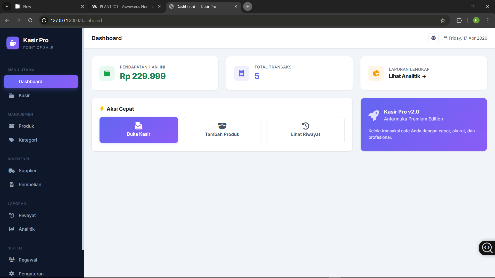
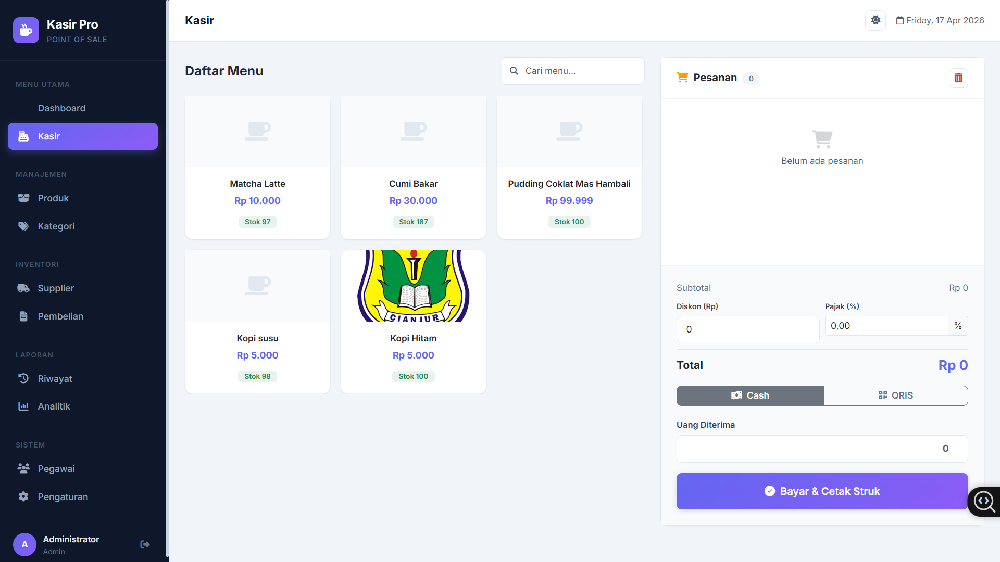
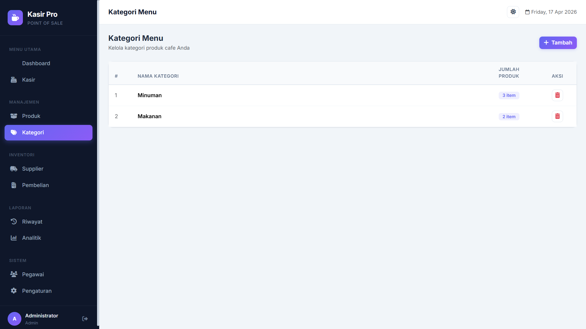
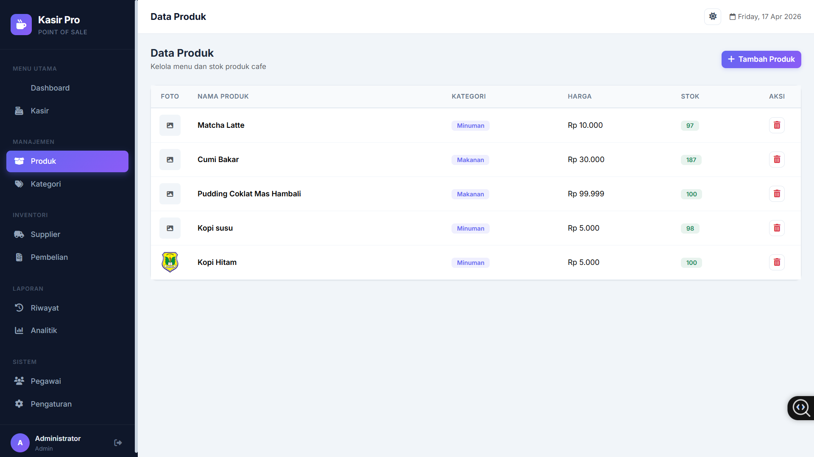
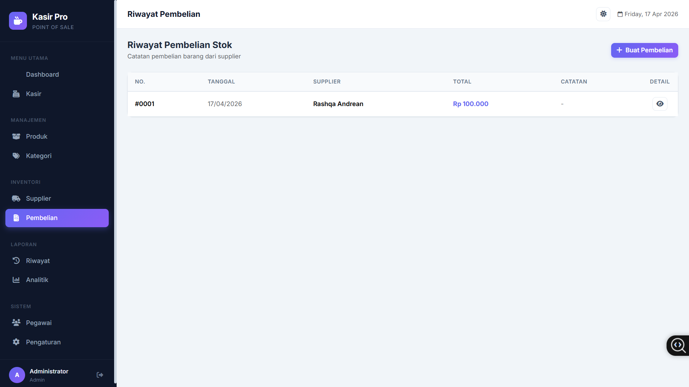
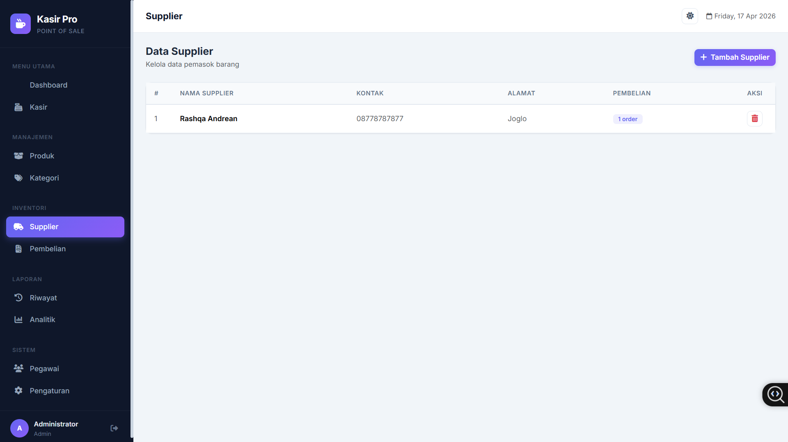
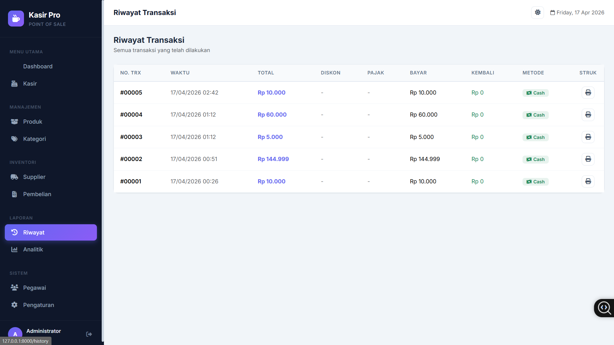
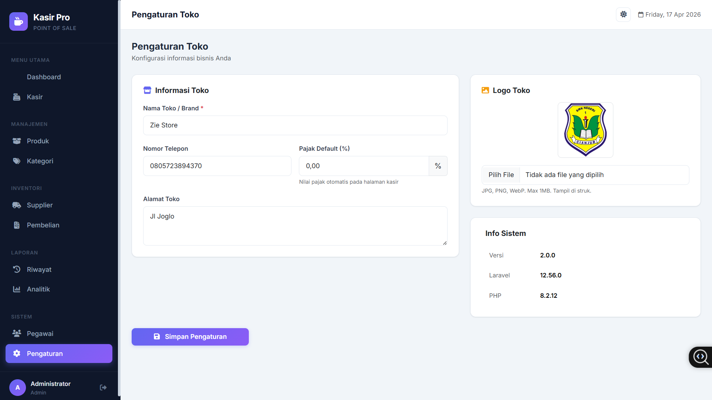
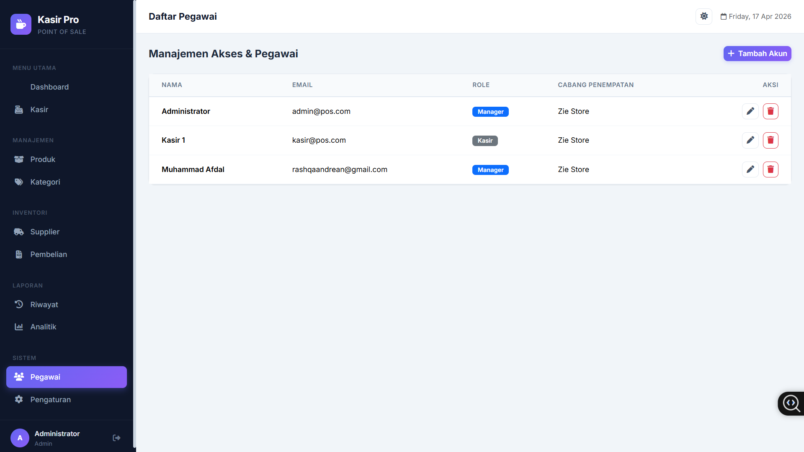

# ☕ Cafe POS Pro

A modern, responsive, and production-ready Point of Sales (POS) web application for cafes and small businesses. Built with Laravel, this system provides a complete solution for managing sales, inventory, suppliers, and payments with a clean and interactive user experience.

---

## 🚀 Key Features

### 🧾 Smart POS System

* Fast and intuitive cashier interface
* Add to cart with real-time calculation
* Multiple payment methods:

  * Cash
  * QRIS (via Midtrans - sandbox)
* Automatic change calculation
* Print-ready receipt

---

### 📦 Product & Inventory Management

* Product with image support
* Category management
* Stock tracking:

  * Auto reduce on sales
  * Auto increase from supplier purchases

---

### 🏪 Supplier & Stock Purchase

* Supplier management
* Purchase stock from suppliers
* Track purchase history
* Record cost price

---

### 📊 Dashboard & Analytics

* Daily sales summary
* Sales reports with date filter
* Best-selling products
* Interactive charts

---

### 🔐 Authentication & Security

* Login & Register system
* Role-based access:

  * Admin
  * Cashier
* CSRF protection
* Input validation & sanitization
* Secure transaction handling

---

### 🎨 Modern UI/UX

* Clean dashboard layout (sidebar + topbar)
* Fully responsive (desktop & mobile)
* Smooth animations:

  * Loading skeleton
  * Cart interaction
  * Transaction success feedback
* Toast notifications

---

### ⚡ Performance & Stability

* Optimized database queries (Eloquent relationships)
* Prevent duplicate submissions (debounce & validation)
* Clean and scalable code structure

---

## 🛠️ Tech Stack

* Laravel
* MySQL
* Blade Template Engine
* Tailwind CSS / Bootstrap
* JavaScript (Vanilla)
* Midtrans Payment Gateway

---

## ⚙️ Installation

1. Clone repository

   ```bash
   git clone https://github.com/username/cafe-pos-pro.git
   ```

2. Masuk ke folder

   ```bash
   cd cafe-pos-pro
   ```

3. Install dependency

   ```bash
   composer install
   ```

4. Setup environment

   ```bash
   cp .env.example .env
   php artisan key:generate
   ```

5. Setup database

   ```env
   DB_DATABASE=cafe_pos
   DB_USERNAME=root
   DB_PASSWORD=
   ```

6. Setup Midtrans (optional)

   ```env
   MIDTRANS_SERVER_KEY=your_key
   MIDTRANS_CLIENT_KEY=your_key
   MIDTRANS_IS_PRODUCTION=false
   ```

7. Run migration

   ```bash
   php artisan migrate
   ```

8. Jalankan aplikasi

   ```bash
   php artisan serve
   ```

---

## 🗄️ Database Structure

Main tables:

* `users`
* `categories`
* `products`
* `transactions`
* `transaction_items`
* `suppliers`
* `purchases`
* `purchase_items`

---

## 🔄 Transaction Flow

1. Cashier selects products
2. Items added to cart
3. System calculates total (with optional tax/discount)
4. Customer chooses payment method
5. Payment processed (manual or Midtrans)
6. Stock updated automatically
7. Transaction saved & receipt generated

---

## 📸 Preview

<p align="center">
  
</p>

<p align="center">
  
</p>

<p align="center">
  
</p>

<p align="center">
  
</p>

<p align="center">
  
</p>

<p align="center">
  
</p>

<p align="center">
  
</p>

<p align="center">
  
</p>

<p align="center">
  
</p>

<p align="center">
  
</p>

<p align="center">
  
</p>
---

## 🧠 Use Case

* Cafe & Coffee Shop
* Small Restaurant
* UMKM Retail
* Food & Beverage Business

---

## 📌 Project Status

🚧 Production-ready (ongoing improvements for scalability & integrations)

---

## 💡 Future Improvements

* Real QRIS production integration
* Multi-outlet support
* Role permission management
* Offline mode (PWA)
* Thermal printer integration
* Inventory forecasting

---

## 🤝 Contributing

Contributions are welcome!
Feel free to fork this repository and submit a pull request.

---

## 📄 License

This project is licensed under the MIT License.

---

## 👨‍💻 Author

Developed by [Your Name]

---

## ⭐ Support

If you find this project useful, consider giving it a ⭐ on GitHub!
